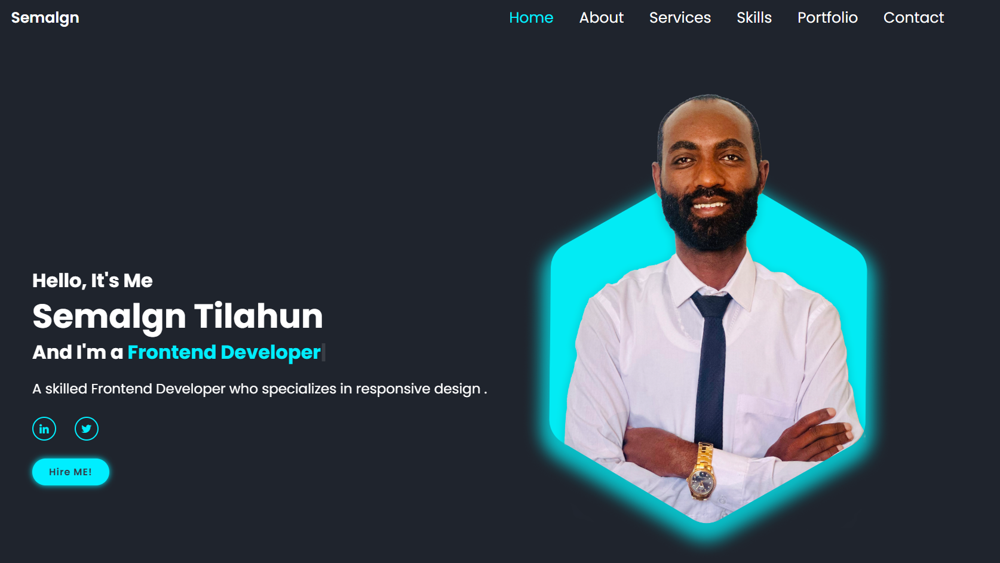

<div align="center">
  <br />
    <a>
      
    </a>
  <br />

  <div>
    
    
    
  </div>

  <h3 align="center">Interactive Portfolio Website</h3>
</div>

## 📋 <a name="table">Table of Contents</a>

1. ⚙️ [Tech Stack](#tech-stack)
2. 🔋 [Features](#features)
3. 🤸 [Quick Start](#quick-start)

## <a name="tech-stack">⚙️ Tech Stack</a>

- HTML5
- CSS3
- JavaScript

## <a name="features">🔋 Features</a>

### Features of the Portfolio Website

👉 Realistic lighting and shadows

👉 Responsive design with CSS 

👉 Micro Interactions

👉 Multi-section layout (About, Portfolio, Contact)

👉 Mobile optimized experience
  and many more, including code architecture and reusability.

**Cloning the Repository**

```bash
git clone https://github.com/Semalgn/portfolio-web-site.git
cd portfolio-web-site
```
## Feel free to contact me!
